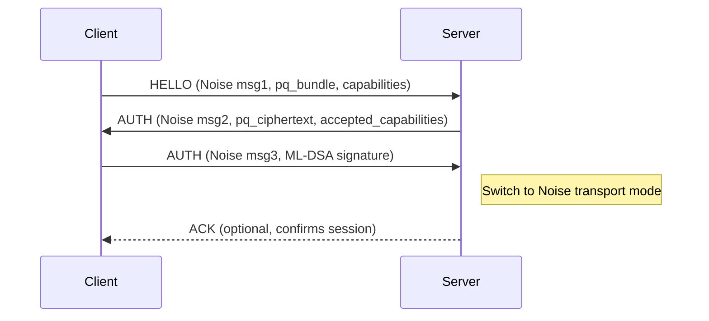

# CommuCat CCP-1 Specification

CCP-1 (CommuCat Protocol v1) is a binary framing protocol transported over a duplex HTTP/2 or HTTP/1.1 (chunked) stream that is upgraded at `/connect`. The tunnel is TLS 1.3, with an application-layer Noise handshake layered on top of the HTTP stream to deliver forward secrecy. Frames are encrypted end-to-end by the clients; the server forwards ciphertext without access to content.

## Transport

* **Upgrade endpoint**: `POST /connect`
* **Encapsulation**: HTTP/2 data frames or HTTP/1.1 chunked body
* **Session selection**: single request multiplexes virtual channels via the `channel_id` field
* **Tracing**: incoming `traceparent` header is echoed in structured logs

Once the HTTP response headers (status `200`) are emitted, both peers exchange CCP-1 frames until one closes the stream.

## Frame Format

Every frame is length-prefixed using LEB128/varint encoding:

```
frame      = frame_len *frame_bytes
frame_len  = varint (octet length of frame_bytes)
frame_bytes = frame_type channel_id sequence payload_len payload_bytes
frame_type  = u8 enum
channel_id  = varint
sequence    = varint (monotonic per sender)
payload_len = varint
payload_bytes = opaque bytes interpreted per frame type
```

### Limits

* `frame_len` MUST be ≤ 16,777,216 bytes (16 MiB). Larger frames are rejected.
* JSON control payloads MUST be ≤ 262,144 bytes (256 KiB) after serialization.
* `channel_id` and `sequence` MUST fit into 32-bit unsigned integers; higher values are rejected.
* Implementations MUST reject frames whose declared `payload_len` exceeds the remaining buffer.
* Varints longer than 10 bytes or overflowing 64 bits MUST raise a decoding error.

### Version Negotiation

* CCP-1 v1 peers announce support via either `protocol_version` (legacy single value) or `supported_versions` (array of unsigned integers).
* The server selects the highest common version from the client announcement and its own `supported_versions`, falling back to v1 for clients lacking these fields.
* When no overlap exists, the server returns an `ERROR` frame with `title` "Protocol Version Mismatch" and closes the stream.
* Successful handshakes echo the negotiated value in subsequent `AUTH` control frames (`protocol_version`) and advertise the server list as `supported_versions`.

### Frame Types

| Type | Code | Payload semantics |
|------|------|-------------------|
| `HELLO` | `0x01` | JSON control envelope initiating Noise handshake |
| `AUTH` | `0x02` | JSON control envelope carrying handshake continuations |
| `JOIN` | `0x03` | JSON control, membership declaration for channel |
| `LEAVE` | `0x04` | JSON control removing membership |
| `MSG` | `0x05` | Ciphertext payload delivered end-to-end |
| `ACK` | `0x06` | JSON control acknowledging specific sequences |
| `TYPING` | `0x07` | Ciphertext or lightweight hint routed like `MSG` |
| `PRESENCE` | `0x08` | JSON control heartbeat/availability update |
| `KEY_UPDATE` | `0x09` | Ciphertext with new encryption material |
| `GROUP_CREATE` | `0x0a` | JSON control describing new group (persists roster) |
| `GROUP_INVITE` | `0x0b` | JSON control inviting member to group (role aware) |
| `GROUP_EVENT` | `0x0c` | Ciphertext or control for group fanout |
| `ERROR` | `0x0d` | JSON control describing protocol errors |
| `CALL_OFFER` | `0x0e` | JSON control proposing an audio/video session |
| `CALL_ANSWER` | `0x0f` | JSON control accepting or rejecting a call offer |
| `CALL_END` | `0x10` | JSON control terminating a call session |
| `VOICE_FRAME` | `0x11` | Ciphertext carrying an Opus media frame |
| `VIDEO_FRAME` | `0x12` | Ciphertext carrying a VP8 media frame or fragment |
| `CALL_STATS` | `0x13` | JSON control reporting live media quality metrics |

Control payloads are UTF-8 JSON documents carried inside the CCP frame. Ciphertext payloads are arbitrary byte arrays produced by the clients after Noise handshake completion.

### Varint Encoding

CCP-1 encodes integers in little-endian base-128 with continuation bit (`0x80`). Implementations must reject integers that overflow 64 bits or consume more than 10 bytes.

## Call Signaling and Media Transport

Real-time calls are negotiated with the trio of `CALL_OFFER`, `CALL_ANSWER`, and `CALL_END` control frames. Media content is transmitted over the existing encrypted tunnel using `VOICE_FRAME` (Opus audio) and `VIDEO_FRAME` (VP8 video) frames. Each media frame inherits the channel membership of the negotiated call and is acknowledged with a regular `ACK` carrying `{"call_id": ...}`.

### Call Offer (`CALL_OFFER`)

```jsonc
{
  "call_id": "uuid-v4",
  "from": "device@domain",
  "to": ["peer-device@domain"],
  "media": {
    "audio": {
      "codec": "opus",
      "bitrate": 16000,
      "sample_rate": 48000,
      "channels": 1,
      "fec": true,
      "dtx": true
    },
    "video": {
      "codec": "vp8",
      "max_bitrate": 500000,
      "max_resolution": { "width": 640, "height": 360 },
      "frame_rate": 24,
      "adaptive": true
    },
    "mode": "full_duplex" // or "half_duplex" for push-to-talk
  },
  "transport": {
    "prefer_relay": true,
    "udp_candidates": [
      { "address": "198.51.100.10", "port": 3478, "protocol": "udp" }
    ],
    "fingerprints": ["hex(fingerprint)"]
  },
  "expires_at": 1700000000,
  "ephemeral_key": "hex(ephemeral_public)",
  "metadata": {}
}
```

The offer describes the requested codecs and duplex mode. Implementations should fall back to audio-only if the callee cannot satisfy the proposed video profile. `transport` hints are advisory; the initial release always relays through the server.

### Call Answer (`CALL_ANSWER`)

```jsonc
{
  "call_id": "uuid-v4",
  "accept": true,
  "media": {
    "audio": { "bitrate": 12000, "codec": "opus", "sample_rate": 48000, "channels": 1, "fec": true, "dtx": true },
    "video": null,
    "mode": "full_duplex"
  },
  "reason": null,
  "metadata": {}
}
```

Declining a call sets `accept` to `false` and includes a `reason` of `"busy"`, `"decline"`, `"unsupported"`, `"timeout"`, or `"error"`. When both parties accept, media transmission may begin immediately. The server acknowledges each offer and answer with an `ACK` that mirrors `call_id` and the inbound sequence.

### Call Termination (`CALL_END`)

Call teardown frames include the `call_id` and a reason string (`"hangup"`, `"cancel"`, `"failure"`, or `"timeout"`). The server relays termination frames to every participant and releases any state it tracked for the session. Disconnects or unexpected exits also trigger a synthesized `CALL_END` with reason `"failure"` and `metadata.system = true`.

### Media Frames

* `VOICE_FRAME` payloads contain a single Opus packet produced with the negotiated parameters (default: 20 ms, mono, 16 kbps, FEC enabled). Frames inherit the channel identifier of the call and are sequenced just like `MSG` frames to drive jitter buffers.
* `VIDEO_FRAME` payloads carry either a full VP8 frame or a deterministic fragment. Large frames SHOULD be split into MTU-sized chunks before encryption. The client reconstructs full images using the `frame.sequence` field.

### Quality Reporting (`CALL_STATS`)

Participants may periodically emit quality telemetry to help peers adapt their bitrate:

```jsonc
{
  "call_id": "uuid-v4",
  "direction": "send", // or "receive"
  "audio": { "bitrate": 16000, "packet_loss": 0.01, "jitter_ms": 8, "rtt_ms": 95 },
  "video": { "bitrate": 350000, "packet_loss": 0.05, "jitter_ms": 25, "frames_per_second": 15 },
  "timestamp": 1700000100
}
```

Clients respond to stats heuristics at the application layer (e.g., throttling video or switching to push-to-talk) while servers simply relay the telemetry.

### Voice Messages inside `MSG`

Short asynchronous voice clips reuse the existing `MSG` frame. The plaintext payload SHOULD be a JSON envelope:

```jsonc
{
  "type": "voice_message",
  "codec": "opus",
  "sample_rate": 48000,
  "channels": 1,
  "frame_duration_ms": 20,
  "frames": ["base64(opus packet 1)", "base64(opus packet 2)", "..."] ,
  "duration_ms": 3200
}
```

Recipients decode each Opus packet in order to reconstruct playback. Clients MAY store the message as a contiguous Opus stream when building media caches.

## Handshake

1. **Client → Server (`HELLO`)**
   ```jsonc
   {
     "pattern": "XK" | "IK",
     "device_id": "opaque",
     "client_static": "hex(x25519_public_key)",
     "handshake": "hex(noise_message_1)",
     "supported_versions": [1],
     "user": {
       "id": "existing-user-id",
       "user_id": "existing-user-id",
       "handle": "desired-handle",
       "display_name": "optional nickname",
       "avatar_url": "https://..."
     },
     "capabilities": ["noise", "zstd", ...]
   }
   ```
   The server loads the device metadata, validates the static key, negotiates the protocol version, and prepares a Noise responder state using the configured prologue.

2. **Server → Client (`AUTH`)**
   ```jsonc
   {
     "session": "opaque_session_id",
     "handshake": "hex(noise_message_2)",
     "server_static": "hex(server_x25519_public)",
     "protocol_version": 1,
     "supported_versions": [1],
     "user": {
       "id": "resolved-user-id",
       "user_id": "resolved-user-id",
       "handle": "effective-handle",
       "display_name": "optional nickname",
       "avatar_url": "https://..."
     },
     "pairing_required": false
   }
   ```

3. **Client → Server (`AUTH`)**
   ```jsonc
   { "handshake": "hex(noise_message_3)" }
   ```

After message three the Noise state switches into transport mode. The server never accesses plaintext payloads. A final `ACK` frame with `{ "handshake": "ok", "pairing_required": false, "user": {...} }` confirms tunnel readiness.

If `max_auto_devices_per_user` is reached or `auto_approve_devices` is disabled, the server immediately returns an `ERROR` frame with `title`=`PairingRequired` and closes the stream. The client should obtain a pairing code over REST and re-register the device via `POST /api/pair/claim`.

*Profile provisioning*: the `user` object in `HELLO` lets clients attach devices to existing profiles (`id`, alias `user_id`) or request new profiles (`handle`, plus optional `display_name` and `avatar_url`). When auto-approval is enabled, absent `id` instructs the server to mint a fresh user. The server echoes canonical profile fields (including both `id` and `user_id`) in the `AUTH` response and completion `ACK`, ensuring clients persist consistent identifiers.

*Noise parameters*: `Noise_XK_25519_ChaChaPoly_BLAKE2s` or `Noise_IK_25519_ChaChaPoly_BLAKE2s` with empty PSKs and configurable prologue. Clients derive AEAD keys for subsequent ciphertext frames.

*Device key audit*: whenever a device is auto-approved or rotates a static key, the server records a row in `device_key_event` (event id, device id, public key, timestamp). Registrations that fail to persist this audit trail are rejected to prevent unauthenticated devices from joining silently.

### Feature Flags and Capability Negotiation

The wire format remains stable; advanced behaviour is gated behind Cargo features and runtime capability negotiation. Implementations advertise optional components through the `HELLO.capabilities` array. The initial set of extensions introduced in CCP-1.1 is:

| Capability string | Compile-time feature | Purpose |
|-------------------|----------------------|---------|
| `pq-hybrid`       | `commucat-crypto/pq` | Activates post-quantum hybrid key establishment based on ML-KEM-768 and ML-DSA-65 |
| `adaptive-obf`    | `commucat-proto/obfuscation` | Enables adaptive protocol polymorphism and DAITA/REALITY-style traffic shaping |

Servers echo the subset they accept inside the second `AUTH` message (`accepted_capabilities`). If a peer advertises a capability that is not echoed back it MUST NOT be used on that connection.

### Hybrid Key Establishment (`pq`)

When both sides negotiate `pq-hybrid`, the Noise transport keys are immediately augmented with an ML-KEM-768 exchange and a deterministic ML-DSA signature bundle. The flow is layered on top of Noise:



1. **Credential announcement** – the client appends a `pq_bundle` object to the first `HELLO` payload:
   ```jsonc
   {
     "pq_bundle": {
       "kem_public": "base64(mlkem768_public)",
       "kem_ciphertext": null,
       "signature_public": "base64(mldsa65_public)",
       "one_time_keys": ["base64(mlkem768_public)"]
     }
   }
   ```
   The server caches the presented `kem_public` and Dilithium verifying key alongside classical Signed PreKey material.
2. **Responder encapsulation** – when completing the Noise handshake, the server performs `encapsulate_hybrid()` using the advertised ML-KEM key and mixes the ML-KEM shared secret together with the classical X3DH result via `HKDF(Sha3-512)`. The ciphertext is delivered inside the `AUTH` payload:
   ```jsonc
   {
     "pq_ciphertext": "base64(mlkem768_ciphertext)",
     "pq_context": {
       "kdf": "hkdf-sha3-512",
       "salt": "base64(previous_root_key)",
       "label": "commucat.hybrid.session.v1"
     }
   }
   ```
3. **Client confirmation** – the client executes `decapsulate_hybrid()` with its ML-KEM secret, derives the same 96 B of material (`root_key`, `sending_chain`, `receiving_chain`), and acknowledges by signing the negotiated transcript with ML-DSA-65. The signature is placed in the first encrypted `ACK` frame.

## Forward Error Correction & Multipath Delivery

CommuCat tunnels shard payloads across concurrent transports to raise resistance against active interference and link degradation.

* **Codec**: each plaintext frame is segmented by a RaptorQ encoder (`mtu` defaults to 1,152 bytes) and produces both systematic symbols and repair packets. The repair overhead can be advertised by the assisting endpoint and defaults to 35% of the source symbols.
* **Dispatch**: systematic symbols are striped across every active path in round-robin order. Repair symbols are biased towards non-primary paths so that censored primaries still recover with high probability.
* **Recovery**: receivers reconstruct frames by feeding any combination of systematic/repair packets into a RaptorQ decoder until the original payload surfaces. Packet metadata (`ObjectTransmissionInformation`) is attached to the envelope so every path can decode independently.
* **Telemetry**: the server increments `commucat_security_fec_packets` for every generated segment and records the average number of paths used during a session.

## Multipath P2P Assistance

`POST /api/p2p/assist` returns transport recommendations and ephemeral cryptographic material that two peers can use to bootstrap a direct tunnel:

```jsonc
{
  "noise": {
    "pattern": "Xk",
    "prologue_hex": "636f6d6d75636174",
    "device_seed_hex": "...",
    "static_public_hex": "..."
  },
  "pq": {
    "identity_public_hex": "...",
    "signed_prekey_public_hex": "...",
    "kem_public_hex": "...",
    "signature_public_hex": "..."
  },
  "transports": [
    { "path_id": "primary", "transport": "Reality", "resistance": "Maximum", "latency": "High", "throughput": "High" },
    { "path_id": "backup", "transport": "Shadowsocks", "resistance": "Enhanced", "latency": "Medium", "throughput": "Medium" }
  ],
  "multipath": {
    "fec_mtu": 1152,
    "fec_overhead": 0.35,
    "primary_path": "primary",
    "sample_segments": {
      "primary": { "total": 4, "repair": 1 },
      "backup": { "total": 3, "repair": 2 }
    }
  },
  "obfuscation": {
    "reality_fingerprint_hex": "...",
    "domain_fronting": true,
    "protocol_mimicry": true,
    "tor_bridge": false
  },
  "security": {
    "noise_handshakes": 17,
    "pq_handshakes": 12,
    "fec_packets": 384,
    "multipath_sessions": 9,
    "average_paths": 2.6,
    "censorship_deflections": 5
  }
}
```

The request body may specify alternative path candidates, a `peer_hint` domain for direct rendezvous, and FEC parameters; an empty payload defaults to the server's canonical egress endpoints. Returned Noise seeds are ephemeral and should be used immediately to derive both classical and PQ keys; long-term storage is discouraged.

## Security Telemetry

* `GET /api/security-stats` exposes the live `SecuritySnapshot` counters in JSON form, mirroring the Prometheus metrics.
* The `/metrics` endpoint now emits `commucat_security_*` counters for Noise/PQ handshakes, RaptorQ packet production, multipath utilisation and censorship deflection attempts.
* Clients SHOULD incorporate these gauges in their health heuristics and alarm when counters stop progressing (potential DoS) or grow abnormally fast (possible active attack).

The derived values feed a post-quantum hardened double ratchet (`HybridRatchet`). Re-key events use fresh one-time ML-KEM keys from the announced bundle, ensuring every ratchet step retains ML-KEM entropy in addition to classical X25519 material. Implementations MUST zeroise `HybridKeyMaterial` once the ratchet is advanced.

### Adaptive Protocol Polymorphism (`adaptive-obf`)

When `adaptive-obf` is negotiated, peers wrap every CCP frame in an `ObfuscatedPacket` prior to transport-mode encryption. The structure is intentionally protocol-agnostic:

```text
prefix_s1 || snapshot || frame_bytes || suffix_s2 || MAC16
```

* `prefix_s1` / `suffix_s2` – 0–64 B of pseudorandom padding sampled per packet. The length ranges are adjusted in real time by the policy engine to mimic burstiness or silence.
* `snapshot` – a JSON-serialised [`ProtocolSnapshot`](crates/proto/src/obfuscation.rs) describing the decoy protocol (QUIC Initial, DNS Query, SIP INVITE, TLS 1.3 ClientHello/REALITY, or WebRTC data channel). Each snapshot embeds an AmnesiaWG signature salt and a DAITA v2 automaton state so that packet timing and byte distributions evolve probabilistically.
* `frame_bytes` – the original CCP frame as produced by `Frame::encode()`.
* `MAC16` – the first 16 bytes of `BLAKE3(key, prefix || snapshot || header || payload || suffix)`. The MAC key is derived via `ObfuscationKey::derive("commucat.obf", hkdf_root)` and rotates whenever the hybrid ratchet advances.

Peers manage mimic selection through the `AdaptiveObfuscator` trait implementation. The default strategy weighs HTTPS/REALITY and QUIC during benign operation, pivots to DNS + SIP when DPI interference is detected, and boosts WebRTC when latency probes suggest consumer-grade NATs. MAC verification happens before decoding the inner frame; tampering yields a terminal `ERROR` frame with `title="IntegrityCheckFailed"`.

Feature-flag builds keep the new machinery completely opt-in. Disabling `obfuscation` or `pq` reverts the handshake and transport pipeline back to the minimal CCP-1 flow described earlier.

### Compliance & Known Limitations
- REST API не содержит встроенного rate-limiting; рекомендуется внешний firewall или reverse-proxy throttling.
- Zero-knowledge proofs упоминаются в дорожной карте, но пока не реализованы.
- Обфускация и PQ опциональны и должны быть согласованно включены на обеих сторонах.
- Управление долговременными секретами (Noise static, federation seed) выполняется вручную (`commucat-cli rotate-keys`) и внешними secret stores; автоматической ротации нет.

### Pluggable Transports (Phase 2)

CommuCat nodes negotiate the outer transport independently from CCP-1. The server provisions a `TransportManager` that ranks transports based on historical success, assessed network quality, and detected censorship pressure. Each transport implements the `PluggableTransport` trait and publishes:

* `handshake()` – establishes or simulates the outer tunnel and returns a `TransportSession` bound to the selected `TransportType`.
* `detect_censorship()` – performs light-weight probes to update the current `CensorshipStatus`.
* Static descriptors for `ResistanceLevel` and `PerformanceProfile` so the scheduler can reason about trade-offs.

Default ranking favours REALITY/XRay (TLS mimicry with true certificates) and AmnesiaWG when the network is healthy, sliding toward QUIC MASQUE, WebSocket, and DNS tunnelling as conditions deteriorate. Tor onion routing remains the terminal fallback for hostile environments.

#### REALITY provisioning

Operators may supply REALITY material via the configuration file or environment:

```toml
[transport]
reality_cert = "certs/reality.pem"
reality_fingerprint = "0123456789abcdef0123456789abcdef0123456789abcdef0123456789abcdef"
```

The certificate is loaded verbatim and cached in-memory; the BLAKE3 fingerprint gates runtime presentation. When both values are set, the REALITY transport becomes available to clients advertising `adaptive-obf`. Missing or mismatched fingerprints disable REALITY while leaving the rest of the fallback chain intact.

Runtime telemetry records the chosen transport per session so operators can spot throttling patterns and pre-emptively adjust the fallback chain if necessary.

## Routing Semantics

* `channel_id` identifies the virtual channel. Clients must send a `JOIN` control frame before routing ciphertext on a new channel.
* `JOIN` payload example:
  ```json
  {
    "members": ["deviceA", "deviceB"],
    "relay": false
  }
  ```
  Setting `relay=true` forces server fan-out even if direct connectivity is possible.
* `LEAVE` removes the sender from server-side routing tables.
* For direct channels the server distributes observed socket addresses via `PRESENCE` control frames, enabling UDP/TCP hole punching attempts. Clients fall back to server relay upon timeout.

### Group Channels

* When a `JOIN` control payload carries `group_id`, the server loads `chat_group` and `group_member` state to validate the roster. Join requests from non-members are rejected.
* `GROUP_CREATE` bridges in-memory routes with persistent membership. The payload shape is:
  ```json
  {
    "group_id": "optional-client-generated",
    "members": ["owner-device", "peer-device"],
    "roles": {"peer-device": "admin"},
    "relay": true
  }
  ```
  The server assigns the sender as `owner`, upserts all listed members, and acknowledges with `{"ack": <seq>, "group_id": "resolved"}`. Subsequent reconnects reuse the stored roster.
* `GROUP_INVITE` lets owners/admins extend the roster:
  ```json
  {
    "group_id": "grp-123",
    "device": "new-device",
    "role": "member"
  }
  ```
  The server normalises roles (promoting requests for `owner` to `admin`) and updates routing tables in-memory and in PostgreSQL. Acks echo the invited device id.

## Federation

When a `JOIN` announces members outside the local domain (`device@remote.example`), or a ciphertext targets an offline remote member, CommuCat signs an event:
```json
{
  "event_id": "opaque",
  "origin": "example.org",
  "scope": "remote.example",
  "payload": {
    "channel": 42,
    "sequence": 12,
    "payload": "hex(ccp_frame)"
  }
}
```
The payload is hashed with BLAKE3 and signed using the configured Ed25519 key. The signed envelope is queued for HTTPS (HTTP/2) delivery to the peer domain.

Peer metadata (`federation_peer`) records domain, endpoint, public key, and status (`active`, `pending`, `blocked`). Static peers from configuration are merged with this registry; runtime discoveries promote `pending` peers to `active` once traffic is queued.

## Error Frames

`ERROR` control payloads follow [RFC 9457](https://www.rfc-editor.org/rfc/rfc9457) shape:
```json
{
  "type": "about:blank",
  "title": "Handshake Failed",
  "status": 403,
  "detail": "invalid static key"
}
```
Clients should treat receipt of `ERROR` as fatal for the stream.

### Codec Diagnostics

Codec failures surfaced during framing SHOULD be translated into terminal `ERROR` frames with machine-readable causes:

| Condition | Suggested `title` |
|-----------|-------------------|
| Unknown frame type | `Invalid Frame Type` |
| No mutually supported protocol version | `Protocol Version Mismatch` |
| Control JSON cannot be parsed | `Invalid Control Payload` |
| Declared frame length exceeds limits | `Frame Too Large` |
| Declared payload length exceeds limits | `Payload Too Large` |
| Control payload exceeds JSON limits | `Control Payload Too Large` |
| Channel or sequence outside allowed range | `Identifier Out Of Range` |
| Auto-approval limit reached | `PairingRequired` |
| Varint exceeds 64-bit width | `Varint Overflow` |
| Buffer underrun before payload end | `Truncated Frame` |

## Sequence Numbers

* Each sender maintains an independent monotonic 32-bit sequence per connection. When reaching `u32::MAX`, peers MUST re-establish the tunnel to reset counters.
* The server asserts monotonic behaviour but does not reset numbers across reconnects.
* `ACK` frames echo the confirmed sequence in the control payload. Clients can resend unacknowledged frames as idempotent envelopes when needed.

## Offline Delivery

Encrypted frames destined for offline members are persisted in PostgreSQL (`relay_queue`) under key `inbox:{device_id}`. Upon reconnect the server replays stored frames assigning fresh sequence numbers for the recipient. Each replay updates `inbox_offset` so clients can resume idempotently and operators can audit the last delivered envelope per entity/channel pair.

## Presence Metadata

Redis presence keys capture profile context so peers can render nicknames and avatars:

```
{
  "entity": "device-id",
  "state": "online" | "offline",
  "expires_at": "RFC3339 timestamp",
  "user": {
    "id": "user-id",
    "handle": "nick",
    "display_name": "optional",
    "avatar_url": "optional"
  }
}
```

## P2P Negotiation

* Observed socket addresses (`client_addr`) are published to channel peers as:
  ```json
  {
    "channel": 7,
    "peer": "deviceA",
    "candidate": "198.51.100.10:52345"
  }
  ```
* Clients attempt simultaneous hole punching. Failure to confirm within client-defined timeout results in continued relay mode.

## Compression and Extensions

* CCP-1 starts uncompressed. After negotiation (e.g., via control frame `{ "compression": "zstd" }`) peers MAY wrap ciphertext payloads in per-message zstd. Negotiation outcome is opaque to the server.
* Additional frame types must be assigned new numeric codes and documented for interoperability.

## Security Considerations

* TLS 1.3 is mandatory; ECH can be enabled on the terminating proxy if supported.
* Noise handshake authenticates devices through pre-registered static keys; the server merely validates and records session metadata.
* Control frames must never contain personally identifiable data; device IDs remain opaque.
* Replay protection is delegated to clients (through sequence tracking) and storage deduplication (`idempotency` table).
