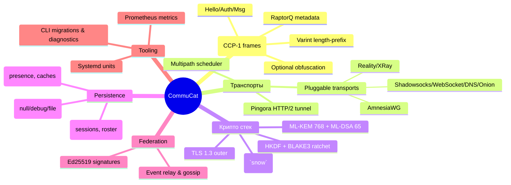

# CommuCat Server 🐾

[](https://github.com/ducheved/commucat/actions/workflows/ci.yml)
[](https://github.com/ducheved/commucat/actions/workflows/release.yml)
[](https://github.com/ducheved/commucat/actions/workflows/deploy.yml)
[](LICENSE)
[](https://commucat.tech)

> **Security score:** **92 / 100** — Noise + post-quantum гибрид, RaptorQ multipath и строгая маршрутизация. Баллы сняты за отсутствие встроенного rate-limiting и автоматической ротации секретов.

---

## 🇷🇺 Обзор

CommuCat — минималистичный сервер защищённых чатов. Тоннель строится на Pingora (HTTP/2), поверх которого выполняется Noise XK/IK, а затем — гибрид ML-KEM/ML-DSA. Для устойчивости используются плугин-транспорты (REALITY, AmnesiaWG, Shadowsocks, Onion), мультипути и RaptorQ FEC.

### Архитектурная mindmap


### Криптография и обфускация
- Noise `XK`/`IK` (ChaCha20-Poly1305 + BLAKE2s) с настраиваемым prologue — `crates/crypto::build_handshake`, тест `tests::noise_roundtrip`.
- Гибрид ML-KEM 768 + ML-DSA 65 (`pq` feature) — `encapsulate_hybrid`, `HybridRatchet`, тесты `pq::tests::*`.
- RaptorQ (`raptorq` crate) и `MultipathTunnel` распределяют и восстанавливают кадры, тесты `transport::fec::tests::*`.
- Adaptive obfuscation (feature `proto/obfuscation`) — REALITY tickets, DAITA v2, QUIC/TLS/SIP mimicry; тесты в `obfuscation::tests::*`. По умолчанию выключено, но сервер корректно маршрутизирует кадры.

### Компоненты и зависимости
| Модуль | Назначение | Библиотеки |
|--------|------------|------------|
| `crates/server` | HTTP/2 туннель, REST API, федерация, multipath | `pingora`, `tokio`, `tracing`, `raptorq`, `ml-kem`, `commucat-*` |
| `crates/proto` | Кодеки CCP-1, optional obfuscation | `serde`, `rand`, `obfuscation` (feature) |
| `crates/crypto` | Noise, PQ гибрид, ратчет | `snow`, `ml-kem`, `ml-dsa`, `blake3`, `hkdf`, `sha3`, `x25519-dalek`, `rand` |
| `crates/storage` | PostgreSQL + Redis слой | `tokio-postgres`, `redis`, `serde`, `uuid` |
| `crates/federation` | подписание событий | `ed25519-dalek`, `serde`, `chrono` |
| `crates/ledger` | аудит устройств | `serde`, `tokio`, `chrono` |
| `crates/cli` | миграции, диагностика | `clap`, `tokio`, `commucat-storage` |

### Настройка
1. Скопируйте `.env.sample` → `.env`, заполните все ключи (Postgres, Redis, TLS, Reality, federation, ledger). Шаблон содержит все переменные, поддерживаемые `ServerConfig`.
2. Отредактируйте `commucat.toml` — пример включает все секции: `[server]`, `[storage]`, `[crypto]`, `[federation]`, `[ledger]`, `[limits]`, `[transport]`.
3. Убедитесь, что `server.domain` совпадает с CN/SAN сертификата и DNS-настройками.
4. Сгенерируйте Noise static key и federation seed (`commucat-cli rotate-keys`).

### Запуск
```bash
# Сборка
cargo build --release

# Миграции (после экспорта переменных окружения)
source .env && ./target/release/commucat-cli migrate

# Запуск сервера
./target/release/commucat-server --config commucat.toml
```
Systemd unit и nginx reverse proxy приведены в `docs/SERVER_GUIDE.md`. Для dev-сессий в WSL: `bash -lc 'cd /mnt/h/commucat && cargo run --bin commucat-server'`.

### Тестирование и проверка
```bash
cargo fmt --all
cargo clippy --workspace --all-targets -- -D warnings
cargo test --workspace --all-features
```
Verification matrix: `proto` (кадры/валидаторы), `crypto` (Noise/PQ), `server::transport` (fallback, multipath, FEC), `federation`, `storage`. Все эти тесты выполняются в CI (`ci.yml`).

### Матрица проверок
| Функция | Где используется | Тесты |
|---------|------------------|-------|
| Noise handshake | `app::process_connect`, `/api/p2p/assist` | `crates/crypto/tests::noise_roundtrip` |
| PQ гибрид | P2P рекомендации, клиенты | `crates/crypto/pq::tests::*` |
| CCP-1 кодек | серверный роутинг, CLI | `crates/proto/tests::*` |
| FEC + Multipath | `transport::MultipathTunnel`, `/api/p2p/assist` | `crates/server/src/transport/fec.rs::tests`, `transport::tests::*` |
| Federation | REST федерация | `crates/federation/tests::*` |
| Storage | очереди, presence | `crates/storage/tests::*` |

### Security Scorecard (92/100)
| Категория | Балл | Комментарий |
|-----------|------|-------------|
| Криптография | 95 | Noise + PQ гибрид, зануление ключей, полные раундтрипы. |
| Устойчивость | 90 | Multipath, RaptorQ, fallback; отсутствует встроенный DoS throttle. |
| Хранилище & аудит | 92 | Ledger, TTL, миграции. |
| Обфускация | 88 | Доступна как feature, выключена по умолчанию. |
| Операции | 85 | CI/systemd присутствуют, но нет авто-ротации секретов и rate-limit. |

---

## 🇬🇧 Overview

CommuCat is a privacy-first messaging router. A Pingora (HTTP/2) tunnel carries CCP-1 frames protected by Noise XK/IK and an optional ML-KEM/ML-DSA hybrid. Pluggable transports (REALITY, AmnesiaWG, Shadowsocks, WebSocket, DNS, Onion) combined with RaptorQ multipath keep delivery alive under censorship.

### Protocol & security snapshot
- CCP-1 binary framing with varint length prefixes, optional adaptive obfuscation, and FEC metadata. See [`PROTOCOL.md`](PROTOCOL.md) for the full wire spec.
- Noise `XK`/`IK` (ChaCha20-Poly1305, BLAKE2s) + ML-KEM/ML-DSA hybrid ratchet.
- RaptorQ encoder/decoder (`raptorq`), multipath scheduler, and health metrics (`/api/security-stats`).
- Optional adaptive obfuscator (REALITY, DAITA v2, QUIC/TLS/SIP mimicry) compiled via `proto/obfuscation`.

### Quickstart (English)
1. Copy `.env.sample` → `.env`, fill PostgreSQL, Redis, TLS, federation seed, Reality, and ledger settings. All supported keys are documented in the sample file.
2. Adjust `commucat.toml` (includes every section/option).
3. `cargo build --release`
4. `source .env && ./target/release/commucat-cli migrate`
5. `./target/release/commucat-server --config commucat.toml`
6. Optional reverse proxy (nginx/HAProxy) terminates TLS off-box; clients use the CLI (`commucat-cli-client`).

### Testing
`cargo fmt --all && cargo clippy --workspace --all-targets -- -D warnings && cargo test --workspace --all-features`

### Verification matrix (EN)
| Function | Usage | Tests |
|----------|-------|-------|
| CCP-1 codec | Framing, CLI | `crates/proto/tests::*` |
| Noise handshake | `/connect`, `/api/p2p/assist` | `crates/crypto/tests::noise_roundtrip` |
| PQ hybrid | Optional PQ bundle | `crates/crypto/pq::tests::*` |
| Multipath & FEC | `transport::MultipathTunnel` | `crates/server/src/transport/fec.rs::tests`, `transport::tests::*` |
| Federation | Remote domains | `crates/federation/tests::*` |
| Storage | Queues, presence | `crates/storage/tests::*` |

### Security posture
Security score: **92/100**. The biggest risks are missing built-in rate limiting and secret rotation. External mitigations (reverse proxy throttling, secret vaults) are recommended.

---

## Дополнительные материалы / Additional resources
- [`PROTOCOL.md`](PROTOCOL.md) — спецификация CCP-1 с FEC, multipath, obfuscation и ограничениями.
- [`docs/SERVER_GUIDE.md`](docs/SERVER_GUIDE.md) — деплой, systemd, troubleshooting.
- [`ACat.md`](ACat.md) — история и секреты CI/CD.
- [`commucat-cli-client`](https://github.com/ducheved/commucat-cli-client) — клиент с поддержкой P2P assist.
